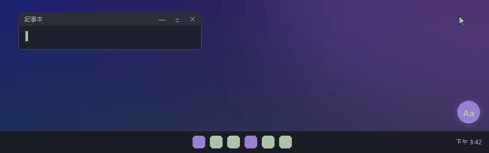
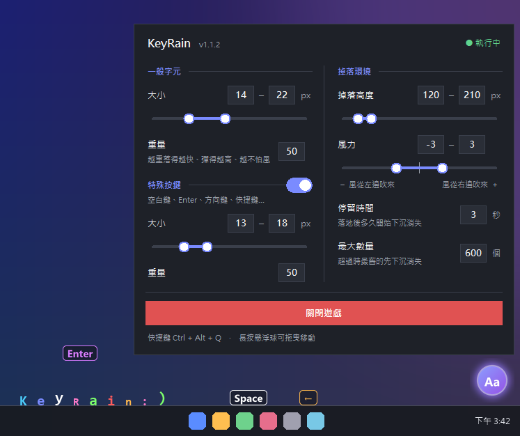

# KeyRain

Windows 桌面小遊戲：你在鍵盤上打的每個字，都會從工具列上方掉下來，彈跳、躺在工具列上，過一陣子再慢慢沉下去消失。

## 下載

到 [**Releases**](https://github.com/Ivla/KeyRain/releases/latest) 下載最新的 `KeyRain.exe`，點兩下就能玩，不需要安裝任何東西。

> **第一次開啟時**，Windows 可能會顯示「Windows 已保護您的電腦」。
> 這是因為程式沒有付費的數位簽章，請按 **「其他資訊」→「仍要執行」**。

## 玩法

- 打字時，字會從工具列上方掉落。
- 空白鍵、Enter、方向鍵、`Ctrl+C` 這類快捷鍵，會變成小小的「鍵帽」掉下來。
- 右下角的**懸浮球**表示遊戲執行中：
  - **左鍵點一下**：打開設定面板
  - **左鍵長按後拖曳**：移動懸浮球
- 設定面板可以調整：
  - **一般字元**：大小（區間）、重量
  - **特殊按鍵**：要不要顯示、大小（區間）、重量
  - **掉落環境**：掉落高度（區間，最高可到螢幕頂端）、風力（-10～10 區間）、落地後停留多久才下沉、畫面上的最大數量
- **重量**：越輕落得越慢、落地反彈越小、越容易被風吹偏；同一批字裡，尺寸越大的越重。
- **風力**：負值是風從左邊吹來、正值是從右邊吹來；設成區間時，每個字會各自感受到在區間內隨機變化的風。
- 結束遊戲：面板裡的「關閉遊戲」，或按 `Ctrl + Alt + Q`。

示範圖由 KeyRain 實際的繪圖程式產生，背景與工具列為示意。

## 更新

有新版本時，懸浮球右上角會出現**紅點**。打開面板按「**立即更新**」，程式會自己下載、替換並重新啟動，不用重新下載檔案。

## 隱私

- 按鍵只在你的電腦上即時轉成畫面，**不記錄、不儲存、不傳送**任何按鍵內容。
- 唯一的連網行為：向 GitHub 查詢是否有新版本，以及下載更新檔。
- 設定存在 `%APPDATA%\KeyRain\settings.json`。

## 已知限制

- 只支援 Windows 10 / 11。
- 焦點在「以系統管理員身分執行」的視窗時，不會掉字（Windows 的安全限制）。
- 程式會偵測全域鍵盤輸入，部分防毒軟體可能會跳出提醒。

## 移除

關閉遊戲後，刪除 `KeyRain.exe` 和 `%APPDATA%\KeyRain` 資料夾即可。
